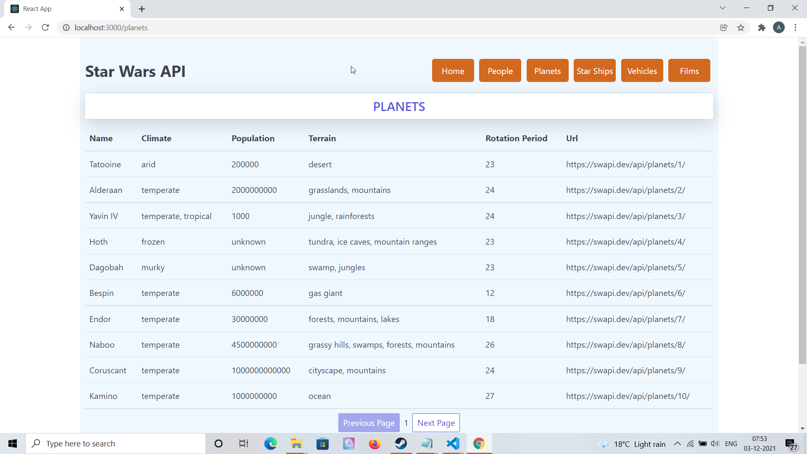
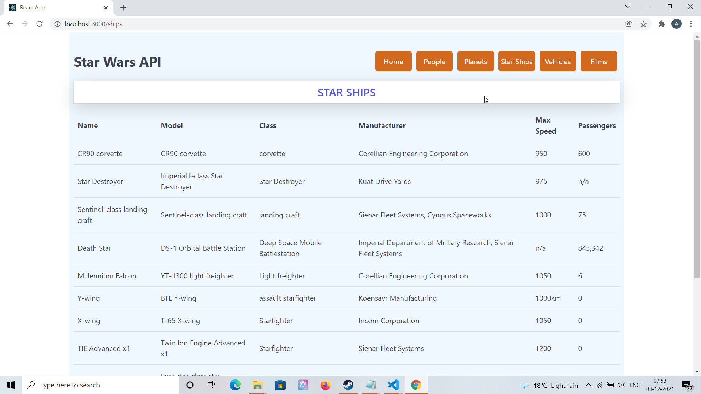
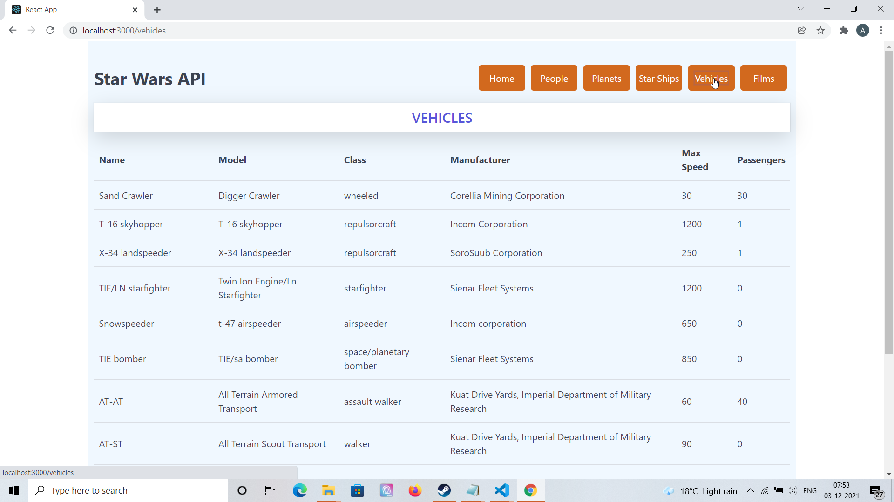

# React Starwars - A Star Wars database application created in React using Star wars API ⚡️

## Project Briefing

This is an web application created using React which integrates with open API for Star Wars to display information from Star Wars franchise in various categories. 

For more information please visit the API website and the docs [here](https://swapi.dev/)

Made with ❤️ by **[@apfirebolt](https://github.com/Apfirebolt/)**
## Features/Requirements

- The app aims at displaying data from the Star Wars API in an attractive looking UI.
- The API has data from various categories like Planets, People, Ships and Vehicles.
- Each category would have a separate page.
- Pagination and API caching is enabled through the use of 'react-query' library.

## Built With

* [React](https://reactjs.org/)
* [React Query](https://react-query.tanstack.com/)
* [Spectre CSS Framework](https://picturepan2.github.io/spectre/)

## Project setup

Simply install node modules for frontend and run conventional commands to see it in development mode on your local system. For production 
environment use 'Docker'.

```
npm install
npm start
```

## Production Deployment

- Docker containers are used for deploying this.
- You can own a virtual server or configure your ECS AWS instances with Docker to deploy this.
- React production build would be served through Nginx, everything would be through Docker containers.

## Future Requirements

- Might as well have detail sections for each character, vehicle and more from the API.
- Search filtering might be added.

## Updates

- More pages to fetch more types of data from the Star Wars API might be available in future, would be notified here.

## Project Screenshots

Some of the screenshots for this application are listed below. For instance this one displays information about planets from the Star Wars franchise.



Star ships information



Data from the vehicles API end-point.


